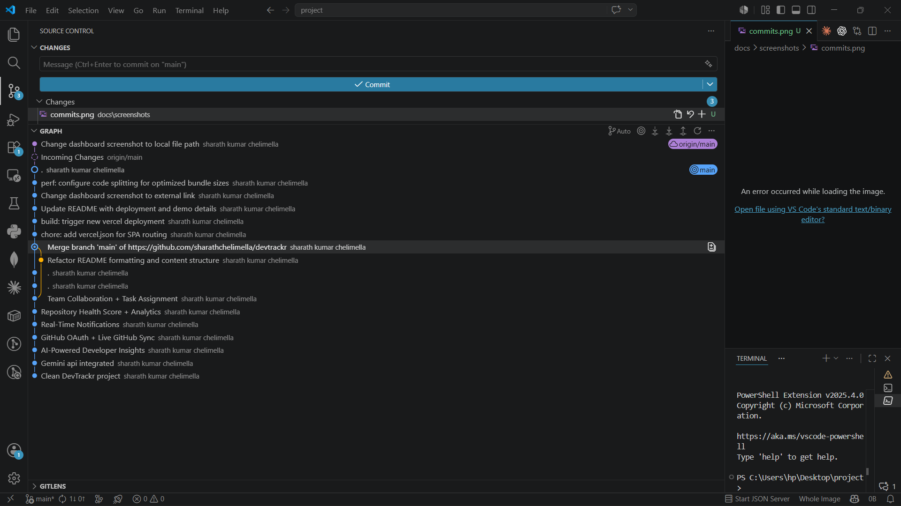
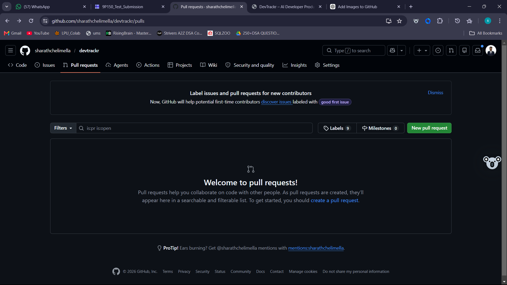
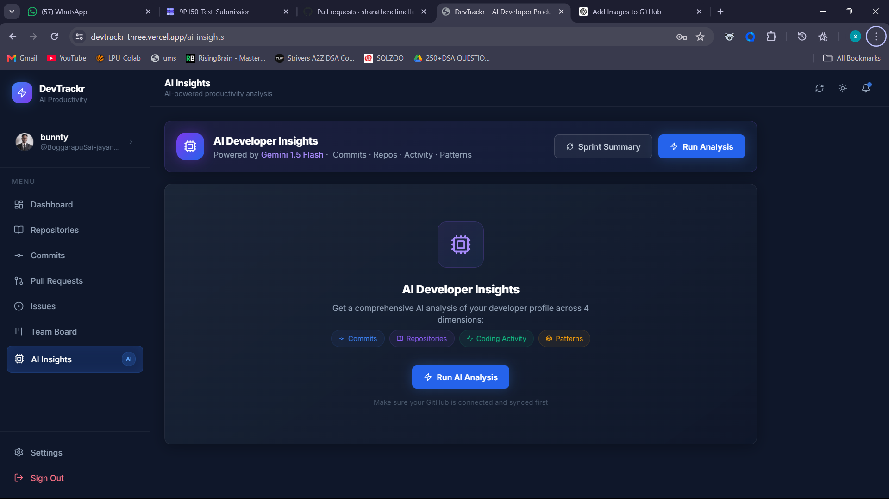

<div align="center">

<h1>🚀 DevTrackr</h1>

<p><strong>AI-Powered Developer Productivity Dashboard</strong></p>

<p>
  
  
  
  
  
  
</p>

<p>
  <a href="https://devtrackr-three.vercel.app/">
    
  </a>
  <a href="https://devtrackr-ou9a.onrender.com">
    
  </a>
  <a href="https://github.com/sharathchelimella/devtrackr">
    
  </a>
</p>

<p>
  DevTrackr connects your GitHub account and delivers AI-powered productivity insights, sprint summaries, and coding analytics — all in a beautiful, dark-mode-ready dashboard.
</p>

</div>

---

## 📋 Table of Contents

- [Overview](#-overview)
- [Deployment](#-deployment)
- [Demo Video](#-demo-video)
- [Screenshots](#-screenshots)
- [Features](#-features)
- [Architecture](#-architecture)
- [Database Schema](#-database-schema)
- [Tech Stack](#-tech-stack)
- [Project Structure](#-project-structure)
- [API Reference](#-api-reference)
- [Setup & Installation](#-setup--installation)
- [Environment Variables](#-environment-variables)
- [GitHub Token Setup](#-github-token-setup)
- [AI Analysis](#-ai-analysis)
- [Security](#-security)
- [Contributing](#-contributing)
- [License](#-license)

---

## 🌟 Overview

DevTrackr is a production-ready full-stack web application that helps developers and engineering teams visualize their GitHub activity and get actionable AI-powered productivity insights.

Connect your GitHub account via a Personal Access Token (PAT), and DevTrackr will:

- Aggregate your repositories, commits, pull requests, and issues
- Score your productivity with an AI model
- Visualize trends with interactive charts
- Summarize your recent sprint activity
- Detect bottlenecks and suggest improvements

---

## 🌐 Deployment

| Service | Platform | URL |
|---|---|---|
| 🖥️ Frontend | Vercel | [devtrackr-three.vercel.app](https://devtrackr-three.vercel.app/) |
| ⚙️ Backend API | Render | [devtrackr-ou9a.onrender.com](https://devtrackr-ou9a.onrender.com) |
| 📦 Source Code | GitHub | [sharathchelimella/devtrackr](https://github.com/sharathchelimella/devtrackr) |

> **Note:** The Render backend is on a free tier and may take 30–60 seconds to wake up on first request after a period of inactivity.

---

## 🎬 Demo Video

> _Record a Loom/YouTube walkthrough and paste the embed link below._

[](https://www.youtube.com/watch?v=YOUR_VIDEO_ID)

---

## 📸 Screenshots

> _Add real screenshots by uploading images to a `/docs/screenshots/` folder in this repo and referencing them below._

### Dashboard

_Metrics overview, commit frequency chart, recent activity feed_

### Repositories

_All connected repos with language badges and stats_

### Commits

_Searchable, sortable commit history_

### Pull Requests

_Open / Merged / Closed filter tabs_

### AI Insights

_Productivity score, recommendations, bottleneck detection_

### Settings (Dark Mode)

_Profile management, GitHub connect, theme toggle_

---

## ✨ Features

| Feature | Description |
|---|---|
| 🔐 JWT Authentication | Signup, login, role-based access with bcrypt hashed passwords |
| 🐙 GitHub Integration | Connect via Personal Access Token (PAT), sync repos / commits / PRs / issues |
| 🤖 AI Insights | OpenAI GPT-4o-mini powered productivity scoring & recommendations |
| 📊 Analytics Dashboard | Recharts graphs for commit frequency, PR status, contributor activity |
| 🌙 Dark Mode | Full theme toggle stored in context |
| ⚡ LRU Caching | In-memory cache for GitHub API calls to avoid rate limiting |
| 🛡️ Security Hardening | Helmet headers, CORS, rate limiting, bcrypt hashing |
| 🎯 Sprint Summaries | AI-generated summaries of recent development activity |
| 🔍 Bottleneck Detection | Identifies stale PRs, inactive contributors, and review delays |

---

## 🏗️ Architecture

```
┌─────────────────────────────────────────────────────────────────┐
│                          BROWSER                                │
│                                                                 │
│   ┌───────────────────────────────────────────────────────┐    │
│   │              React 18 + Vite 4 + Tailwind CSS         │    │
│   │                                                       │    │
│   │   ┌──────────┐  ┌──────────┐  ┌──────────────────┐   │    │
│   │   │  Context  │  │  Pages   │  │    Recharts      │   │    │
│   │   │Auth/Theme │  │Dashboard │  │  Visualizations  │   │    │
│   │   └──────────┘  │ Commits  │  └──────────────────┘   │    │
│   │                 │   PRs    │                           │    │
│   │   ┌──────────┐  │ Issues   │  ┌──────────────────┐   │    │
│   │   │  Axios   │  │AI Insight│  │  Reusable UI     │   │    │
│   │   │ Services │  └──────────┘  │  Components      │   │    │
│   │   └────┬─────┘                └──────────────────┘   │    │
│   └────────┼──────────────────────────────────────────────┘    │
└────────────┼────────────────────────────────────────────────────┘
             │  REST API (HTTP/JSON)
             ▼
┌─────────────────────────────────────────────────────────────────┐
│                    EXPRESS.JS SERVER (Node 18)                   │
│                                                                 │
│   ┌──────────────┐  ┌──────────────┐  ┌──────────────────────┐ │
│   │  Middleware  │  │  Controllers │  │      Services        │ │
│   │  • Helmet    │  │  • Auth      │  │  • GitHub REST API   │ │
│   │  • CORS      │  │  • GitHub    │  │    v3 Integration    │ │
│   │  • RateLimit │  │  • AI        │  │  • OpenAI GPT-4o     │ │
│   │  • JWT Auth  │  │  • Dashboard │  │    mini Analysis     │ │
│   └──────────────┘  └──────────────┘  └──────────────────────┘ │
│                                                                 │
│   ┌──────────────────────────────────────────────────────────┐  │
│   │                  Utils & Caching                         │  │
│   │   • Token Generator  • Async Handler  • node-cache LRU   │  │
│   └──────────────────────────────────────────────────────────┘  │
└────────────────────────────┬────────────────────────────────────┘
                             │  Mongoose ODM
                             ▼
┌─────────────────────────────────────────────────────────────────┐
│                       MONGODB (Atlas)                           │
│                                                                 │
│   ┌──────────┐  ┌──────────┐  ┌──────────┐  ┌──────────────┐  │
│   │  Users   │  │  Repos   │  │ Commits  │  │     PRs      │  │
│   └──────────┘  └──────────┘  └──────────┘  └──────────────┘  │
└─────────────────────────────────────────────────────────────────┘
             │                              │
             ▼                              ▼
  ┌──────────────────┐          ┌────────────────────┐
  │   GitHub API v3  │          │   OpenAI Platform  │
  │  (REST endpoints)│          │  (GPT-4o-mini)     │
  └──────────────────┘          └────────────────────┘
```

### Request Flow

```
User Action → React Component → Axios Service → Express Route
           → JWT Middleware → Controller → Service Layer
           → GitHub API / MongoDB / OpenAI → Response → UI Update
```

---

## 🗄️ Database Schema

DevTrackr uses **MongoDB** with **Mongoose** ODM. Below are the primary collections and their schemas.

---

### `users` Collection

```js
{
  _id:          ObjectId,           // MongoDB document ID
  name:         String,             // Display name (required)
  email:        String,             // Unique, lowercase (required)
  password:     String,             // bcrypt hash (required)
  role:         String,             // "user" | "admin" (default: "user")
  githubToken:  String,             // Encrypted PAT (optional)
  githubUsername: String,           // GitHub login handle
  githubConnected: Boolean,         // Default: false
  avatar:       String,             // URL to avatar image
  createdAt:    Date,               // Auto-managed by Mongoose
  updatedAt:    Date
}
```

---

### `repositories` Collection

```js
{
  _id:          ObjectId,
  userId:       ObjectId,           // ref: "User"
  githubId:     Number,             // GitHub repo ID
  name:         String,             // repo name
  fullName:     String,             // "owner/repo"
  description:  String,
  language:     String,             // Primary language
  isPrivate:    Boolean,
  starCount:    Number,
  forkCount:    Number,
  openIssues:   Number,
  defaultBranch: String,
  htmlUrl:      String,
  syncedAt:     Date,
  createdAt:    Date,
  updatedAt:    Date
}
```

---

### `commits` Collection

```js
{
  _id:          ObjectId,
  userId:       ObjectId,           // ref: "User"
  repoId:       ObjectId,           // ref: "Repository"
  sha:          String,             // Commit SHA hash
  message:      String,             // Commit message
  author: {
    name:       String,
    email:      String,
    date:       Date
  },
  htmlUrl:      String,
  additions:    Number,
  deletions:    Number,
  filesChanged: Number,
  createdAt:    Date,
  updatedAt:    Date
}
```

---

### `pullrequests` Collection

```js
{
  _id:          ObjectId,
  userId:       ObjectId,           // ref: "User"
  repoId:       ObjectId,           // ref: "Repository"
  githubId:     Number,             // GitHub PR number
  title:        String,
  body:         String,
  state:        String,             // "open" | "closed" | "merged"
  author:       String,             // GitHub login
  reviewers:    [String],           // Array of GitHub logins
  labels:       [String],
  createdAt:    Date,
  updatedAt:    Date,
  closedAt:     Date,
  mergedAt:     Date,
  htmlUrl:      String
}
```

---

### `issues` Collection

```js
{
  _id:          ObjectId,
  userId:       ObjectId,           // ref: "User"
  repoId:       ObjectId,           // ref: "Repository"
  githubId:     Number,             // GitHub issue number
  title:        String,
  body:         String,
  state:        String,             // "open" | "closed"
  author:       String,
  assignees:    [String],
  labels:       [{ name: String, color: String }],
  htmlUrl:      String,
  createdAt:    Date,
  updatedAt:    Date,
  closedAt:     Date
}
```

---

### Entity Relationship Diagram

```
┌─────────────┐        ┌───────────────────┐
│    users    │──1:N──▶│   repositories    │
│─────────────│        │───────────────────│
│ _id (PK)    │        │ _id (PK)          │
│ email       │        │ userId (FK)       │
│ password    │        │ name              │
│ githubToken │        │ language          │
└─────────────┘        └─────────┬─────────┘
       │                         │
       │                    1:N  │  1:N          1:N
       │               ┌─────────┴────────┐──────────────┐
       │               ▼                  ▼              ▼
       │       ┌───────────────┐  ┌────────────┐  ┌──────────┐
       │       │    commits    │  │pullrequests│  │  issues  │
       │       │───────────────│  │────────────│  │──────────│
       │       │ userId (FK)   │  │ userId(FK) │  │userId(FK)│
       └──────▶│ repoId (FK)   │  │ repoId(FK) │  │repoId(FK)│
               │ sha           │  │ state      │  │ state    │
               │ message       │  │ mergedAt   │  │ labels   │
               └───────────────┘  └────────────┘  └──────────┘
```

---

## 🧪 Tech Stack

| Layer | Technology | Purpose |
|---|---|---|
| **Frontend** | React 18, Vite 4 | UI framework & build tool |
| **Styling** | Tailwind CSS | Utility-first CSS |
| **Charts** | Recharts | Commit, PR, issue visualizations |
| **HTTP Client** | Axios | API calls from React |
| **State** | React Context API | Auth & theme state |
| **Backend** | Node.js + Express.js | REST API server |
| **Database** | MongoDB + Mongoose | Document storage & ODM |
| **Auth** | JWT + bcryptjs | Stateless auth + password hashing |
| **AI** | OpenAI GPT-4o-mini | Productivity scoring & summaries |
| **GitHub** | GitHub REST API v3 | Repository, commit, PR, issue data |
| **Caching** | node-cache (LRU) | In-memory GitHub API response cache |
| **Security** | Helmet, CORS, express-rate-limit | HTTP headers, origin control, rate limiting |

---

## 📂 Project Structure

```
devtrackr/
├── .gitignore
├── README.md
│
├── server/                         # Express + MongoDB Backend
│   ├── server.js                   # Entry point
│   ├── package.json
│   ├── .env.example
│   │
│   ├── config/
│   │   └── db.js                   # MongoDB connection
│   │
│   ├── controllers/
│   │   ├── authController.js       # Register, login, me
│   │   ├── githubController.js     # Connect, sync, fetch data
│   │   ├── aiController.js         # Run analysis, sprint summary
│   │   └── dashboardController.js  # Aggregate summary
│   │
│   ├── middleware/
│   │   ├── authMiddleware.js       # JWT protect middleware
│   │   ├── errorHandler.js         # Global error handler
│   │   └── rateLimiter.js          # express-rate-limit config
│   │
│   ├── models/
│   │   ├── User.js
│   │   ├── Repository.js
│   │   ├── Commit.js
│   │   ├── PullRequest.js
│   │   └── Issue.js
│   │
│   ├── routes/
│   │   ├── authRoutes.js
│   │   ├── githubRoutes.js
│   │   ├── aiRoutes.js
│   │   └── dashboardRoutes.js
│   │
│   ├── services/
│   │   ├── githubService.js        # GitHub REST API v3 calls
│   │   └── openaiService.js        # OpenAI integration
│   │
│   └── utils/
│       ├── tokenGenerator.js       # JWT sign/verify helpers
│       ├── asyncHandler.js         # Try/catch wrapper
│       └── cache.js                # node-cache LRU setup
│
└── client/                         # React + Vite + Tailwind Frontend
    ├── index.html
    ├── vite.config.js
    ├── tailwind.config.js
    ├── package.json
    │
    └── src/
        ├── main.jsx
        ├── App.jsx
        │
        ├── charts/
        │   ├── CommitFrequencyChart.jsx
        │   ├── PRStatusChart.jsx
        │   └── ContributorActivityChart.jsx
        │
        ├── components/
        │   ├── Navbar.jsx
        │   ├── Sidebar.jsx
        │   ├── StatCard.jsx
        │   ├── RepoCard.jsx
        │   ├── CommitCard.jsx
        │   ├── PRCard.jsx
        │   └── IssueCard.jsx
        │
        ├── context/
        │   ├── AuthContext.jsx      # User auth state
        │   └── ThemeContext.jsx     # Dark/light mode
        │
        ├── layouts/
        │   └── DashboardLayout.jsx
        │
        ├── pages/
        │   ├── Login.jsx
        │   ├── Register.jsx
        │   ├── Dashboard.jsx
        │   ├── Repositories.jsx
        │   ├── Commits.jsx
        │   ├── PullRequests.jsx
        │   ├── Issues.jsx
        │   ├── AIInsights.jsx
        │   └── Settings.jsx
        │
        └── services/
            ├── authService.js
            ├── githubService.js
            ├── aiService.js
            └── dashboardService.js
```

---

## 📡 API Reference

### Authentication

| Method | Endpoint | Auth | Description |
|--------|----------|------|-------------|
| `POST` | `/api/auth/register` | ❌ | Create new user account |
| `POST` | `/api/auth/login` | ❌ | Login and receive JWT |
| `GET` | `/api/auth/me` | ✅ JWT | Get authenticated user profile |

**Register Body:**
```json
{
  "name": "Jane Doe",
  "email": "jane@example.com",
  "password": "securePassword123"
}
```

**Login Response:**
```json
{
  "success": true,
  "token": "eyJhbGciOiJIUzI1NiIs...",
  "user": {
    "_id": "...",
    "name": "Jane Doe",
    "email": "jane@example.com"
  }
}
```

---

### GitHub Integration

| Method | Endpoint | Auth | Description |
|--------|----------|------|-------------|
| `POST` | `/api/github/connect` | ✅ JWT | Save and validate GitHub PAT |
| `POST` | `/api/github/sync` | ✅ JWT | Sync all GitHub data to DB |
| `GET` | `/api/github/repos` | ✅ JWT | List all repositories |
| `GET` | `/api/github/commits` | ✅ JWT | Get commit history |
| `GET` | `/api/github/prs` | ✅ JWT | Get pull requests |
| `GET` | `/api/github/issues` | ✅ JWT | Get issues |

**Connect Body:**
```json
{ "token": "ghp_your_personal_access_token" }
```

---

### AI Analysis

| Method | Endpoint | Auth | Description |
|--------|----------|------|-------------|
| `POST` | `/api/ai/analyze` | ✅ JWT | Run full AI productivity analysis |
| `GET` | `/api/ai/sprint-summary` | ✅ JWT | Get latest sprint summary |

**Analyze Response:**
```json
{
  "productivityScore": 82,
  "recommendations": [
    "Increase PR review turnaround — average merge time is 4.2 days",
    "Consider breaking large commits into smaller atomic changes"
  ],
  "bottlenecks": ["stale-prs", "low-commit-frequency"],
  "sprintSummary": "This week you merged 3 PRs and closed 7 issues..."
}
```

---

### Dashboard

| Method | Endpoint | Auth | Description |
|--------|----------|------|-------------|
| `GET` | `/api/dashboard/summary` | ✅ JWT | Aggregated metrics for dashboard |
| `GET` | `/api/health` | ❌ | Server health check |

---

## ⚙️ Setup & Installation

### Prerequisites

- **Node.js** v18 or higher
- **npm** v9 or higher
- **MongoDB** — local instance or [MongoDB Atlas](https://cloud.mongodb.com) (free tier available)
- **GitHub Personal Access Token** (see [GitHub Token Setup](#-github-token-setup))
- **OpenAI API Key** — optional; app runs in demo mode without it

---

### 1. Clone the Repository

```bash
git clone https://github.com/sharathchelimella/devtrackr.git
cd devtrackr
```

### 2. Install Dependencies

```bash
# Backend
cd server
npm install

# Frontend
cd ../client
npm install
```

### 3. Configure Environment Variables

```bash
cd server
cp .env.example .env
```

Edit `server/.env` with your values:

```env
PORT=5000
MONGO_URI=mongodb://localhost:27017/devtrackr
JWT_SECRET=your_super_secret_key_here_min_32_chars
JWT_EXPIRES_IN=7d
OPENAI_API_KEY=sk-your_openai_key_here   # optional
CLIENT_URL=http://localhost:5173
```

> **Production values (already configured on Render):**
> - `CLIENT_URL` → `https://devtrackr-three.vercel.app`
> - `MONGO_URI` → your MongoDB Atlas connection string

### 4. Start the Application

Open **two terminal windows**:

**Terminal 1 — Backend:**
```bash
cd server
npm run dev
```

**Terminal 2 — Frontend:**
```bash
cd client
npm run dev
```

| Service | URL |
|---|---|
| Frontend | http://localhost:5173 |
| Backend API | http://localhost:5000 |
| Health Check | http://localhost:5000/api/health |

---

## 🔑 Environment Variables

### Server (`server/.env`)

| Variable | Required | Description |
|---|---|---|
| `PORT` | ✅ | Express server port (default: 5000) |
| `MONGO_URI` | ✅ | MongoDB connection string |
| `JWT_SECRET` | ✅ | Secret key for signing JWTs (min 32 chars) |
| `JWT_EXPIRES_IN` | ✅ | JWT expiry duration (e.g. `7d`, `24h`) |
| `CLIENT_URL` | ✅ | Frontend origin URL for CORS |
| `OPENAI_API_KEY` | ❌ | OpenAI API key — enables real AI analysis |

### Client (`client/.env`) — optional

```env
# Local development
VITE_API_URL=http://localhost:5000

# Production (already set on Vercel)
VITE_API_URL=https://devtrackr-ou9a.onrender.com
```

---

## 🐙 GitHub Token Setup

1. Go to **GitHub → Settings → Developer Settings → Personal access tokens → Tokens (classic)**
2. Click **"Generate new token (classic)"**
3. Give it a descriptive name, e.g. `devtrackr`
4. Set expiration (90 days recommended)
5. Select scopes:
   - ✅ `repo` — Full repo access (includes private repos)
   - ✅ `read:user` — Read user profile
6. Click **"Generate token"** and copy the value
7. Paste the token into DevTrackr **Settings → GitHub Connect**

> ⚠️ The token is only shown once — store it securely. DevTrackr stores it encrypted on your MongoDB instance and never exposes it to the frontend.

---

## 🤖 AI Analysis

DevTrackr uses **OpenAI GPT-4o-mini** for cost-efficient analysis.

### With OpenAI Key (Real Mode)
- Genuine productivity scoring (0–100)
- Personalized recommendations from your actual commit/PR patterns
- Smart sprint summaries in natural language
- Bottleneck detection from real activity data

### Without OpenAI Key (Demo Mode)
- Realistic mock insights are returned
- All UI features remain fully functional
- No API calls are made to OpenAI
- Perfect for local development and demos

To enable real AI:
1. Get a key from [platform.openai.com](https://platform.openai.com)
2. Add it to `server/.env` as `OPENAI_API_KEY=sk-...`
3. Restart the server

---

## 🛡️ Security

| Concern | Implementation |
|---|---|
| Password storage | `bcryptjs` — salted hashing, never stored in plain text |
| Authentication | Stateless JWT tokens with configurable expiry |
| HTTP headers | `helmet` — sets secure headers (XSS, Clickjacking, etc.) |
| CORS | Restricted to `CLIENT_URL` origin only |
| Rate limiting | `express-rate-limit` — prevents brute force and DDoS |
| GitHub token | Stored server-side only; never sent to the frontend |
| Input validation | Controller-level validation before DB writes |

---

## 🔄 Data Flow: GitHub Sync

```
User clicks "Sync" in Settings
        │
        ▼
POST /api/github/sync (JWT required)
        │
        ▼
githubController → githubService
        │
        ├─▶ GET https://api.github.com/user/repos
        │        └─▶ Upsert into `repositories` collection
        │
        ├─▶ For each repo:
        │   GET /repos/{owner}/{repo}/commits
        │        └─▶ Upsert into `commits` collection
        │
        ├─▶ GET /repos/{owner}/{repo}/pulls?state=all
        │        └─▶ Upsert into `pullrequests` collection
        │
        └─▶ GET /repos/{owner}/{repo}/issues?state=all
                 └─▶ Upsert into `issues` collection

Responses cached in LRU cache (node-cache) for subsequent requests
```

---

## 🤝 Contributing

Contributions are very welcome! Here's how to get started:

1. **Fork** the repository
2. **Create** a feature branch:
   ```bash
   git checkout -b feature/your-feature-name
   ```
3. **Commit** your changes:
   ```bash
   git commit -m "feat: add your feature description"
   ```
4. **Push** to your fork:
   ```bash
   git push origin feature/your-feature-name
   ```
5. **Open a Pull Request** against `main`

### Commit Convention

This project follows [Conventional Commits](https://www.conventionalcommits.org/):

- `feat:` — New feature
- `fix:` — Bug fix
- `docs:` — Documentation only
- `style:` — Formatting, missing semicolons, etc.
- `refactor:` — Code change that neither fixes a bug nor adds a feature
- `test:` — Adding or correcting tests
- `chore:` — Maintenance tasks

---

## 📈 Roadmap

- [x] Deployed frontend on Vercel
- [x] Deployed backend API on Render
- [ ] GitHub OAuth login (replace PAT flow)
- [ ] Team/organization dashboards
- [ ] Email notifications for stale PRs
- [ ] Slack integration for AI summaries
- [ ] Docker + docker-compose setup
- [ ] CI/CD with GitHub Actions
- [ ] Unit and integration test coverage
- [x] Deployment guide (Vercel + Render)

---

## 📄 License

This project is licensed under the **MIT License** — see the [LICENSE](LICENSE) file for details.

---

<div align="center">

Made with ❤️ for developers by [@sharathchelimella](https://github.com/sharathchelimella)

**DevTrackr © 2025**

</div>
